# 펭귄 데이터셋 분석 보고서

## 1. 데이터셋 개요

**데이터셋 크기**: 344 행, 7 열

### 데이터 구조
```
  species     island  bill_length_mm  bill_depth_mm  flipper_length_mm  body_mass_g     sex
0  Adelie  Torgersen            39.1           18.7              181.0       3750.0    Male
1  Adelie  Torgersen            39.5           17.4              186.0       3800.0  Female
2  Adelie  Torgersen            40.3           18.0              195.0       3250.0  Female
3  Adelie  Torgersen             NaN            NaN                NaN          NaN     NaN
4  Adelie  Torgersen            36.7           19.3              193.0       3450.0  Female
5  Adelie  Torgersen            39.3           20.6              190.0       3650.0    Male
6  Adelie  Torgersen            38.9           17.8              181.0       3625.0  Female
7  Adelie  Torgersen            39.2           19.6              195.0       4675.0    Male
8  Adelie  Torgersen            34.1           18.1              193.0       3475.0     NaN
9  Adelie  Torgersen            42.0           20.2              190.0       4250.0     NaN
```

## 2. 기본 통계

### 수치형 변수 통계
       bill_length_mm  bill_depth_mm  flipper_length_mm  body_mass_g
count      342.000000     342.000000         342.000000   342.000000
mean        43.921930      17.151170         200.915205  4201.754386
std          5.459584       1.974793          14.061714   801.954536
min         32.100000      13.100000         172.000000  2700.000000
25%         39.225000      15.600000         190.000000  3550.000000
50%         44.450000      17.300000         197.000000  4050.000000
75%         48.500000      18.700000         213.000000  4750.000000
max         59.600000      21.500000         231.000000  6300.000000

### 범주형 변수 빈도
#### 종(Species)
species
Adelie       152
Gentoo       124
Chinstrap     68

#### 섬(Island)
island
Biscoe       168
Dream        124
Torgersen     52

#### 성별(Sex)
sex
Male      168
Female    165

### 결측치 정보
species               0
island                0
bill_length_mm        2
bill_depth_mm         2
flipper_length_mm     2
body_mass_g           2
sex                  11

## 3. 데이터 시각화 (10개 이상)

### 그래프 1: 종별 펭귄 개수
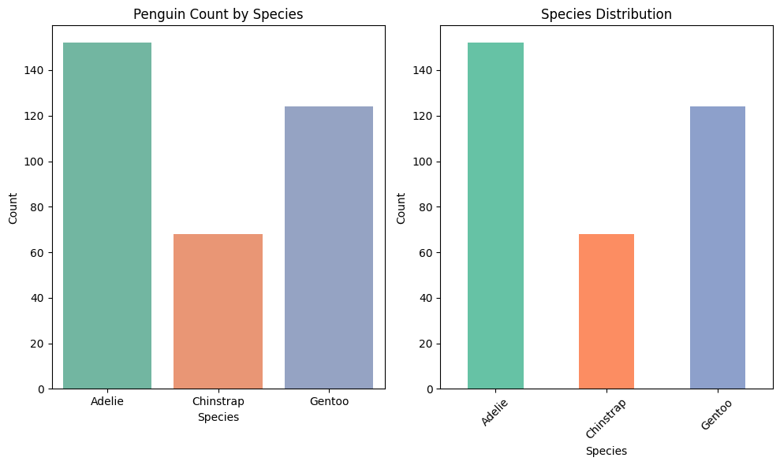

**종별 통계 - 교차표(Crosstab)**
island     Biscoe  Dream  Torgersen
species                            
Adelie         44     56         52
Chinstrap       0     68          0
Gentoo        124      0          0

**종과 성별 교차표(Crosstab)**
sex        Female  Male
species                
Adelie         73    73
Chinstrap      34    34
Gentoo         58    61

**종별 신체 측정값 피봇테이블(Pivot Table)**
                    mean            min            max
          bill_length_mm bill_length_mm bill_length_mm
species                                               
Adelie         38.791391           32.1           46.0
Chinstrap      48.833824           40.9           58.0
Gentoo         47.504878           40.9           59.6

### 그래프 2: 종과 섬별 펭귄 개수
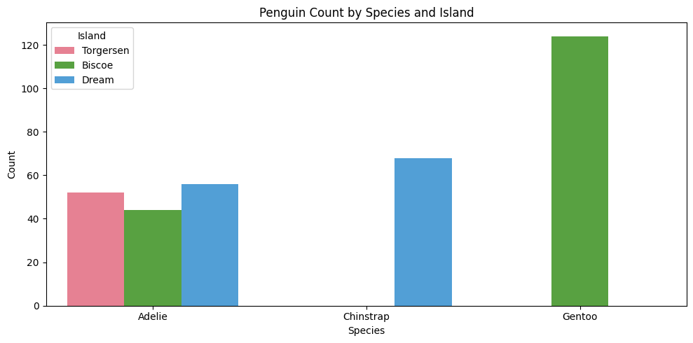

### 그래프 3: 부리 길이 분포
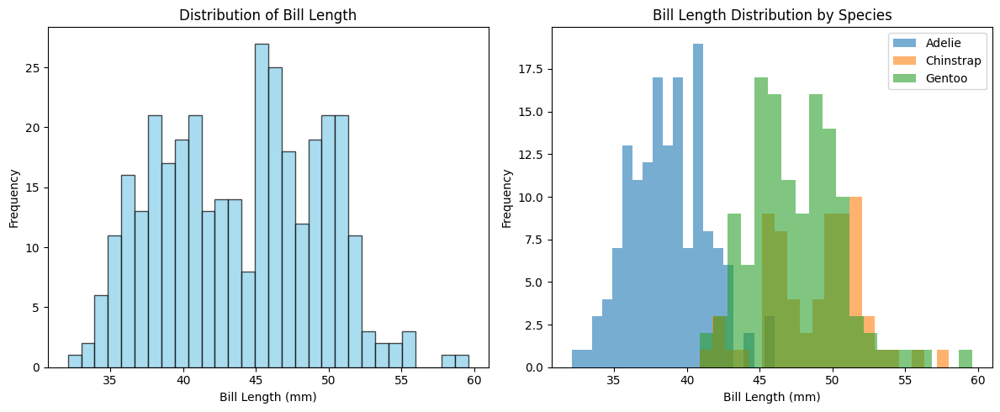

### 그래프 4: 부리 길이 vs 부리 깊이 산점도
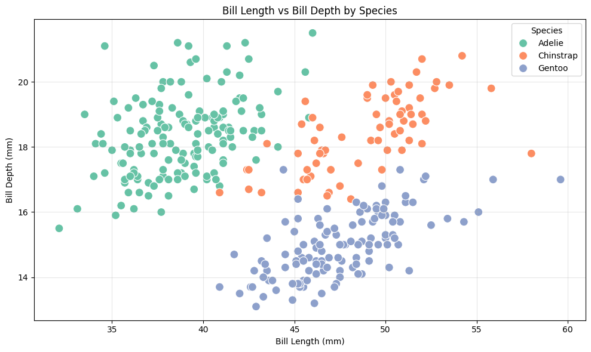

### 그래프 5: 종별 체질량 박스플롯
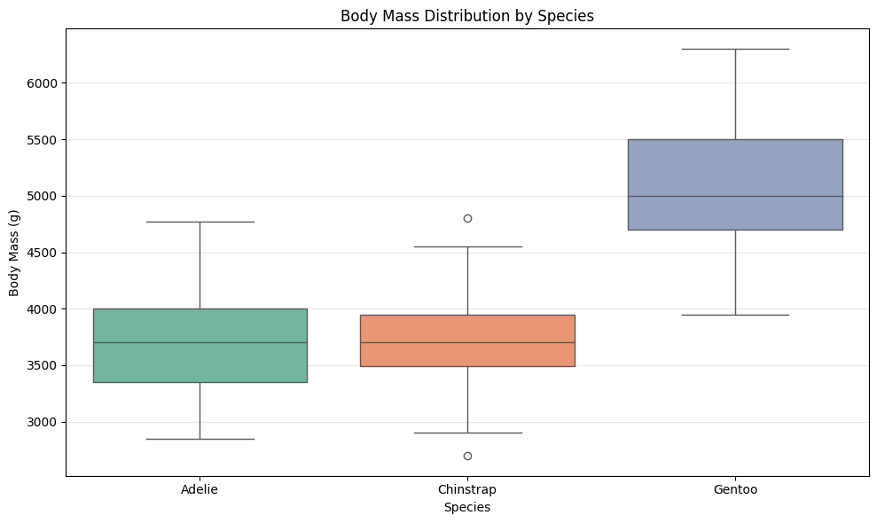

### 그래프 6: 종과 성별 날개 길이 바이올린 플롯
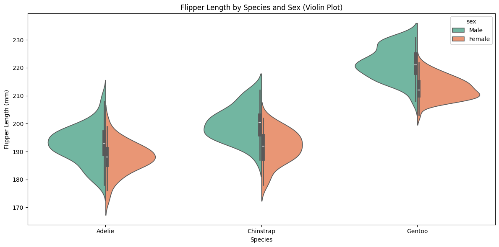

### 그래프 7: 수치형 변수 상관계수 히트맵
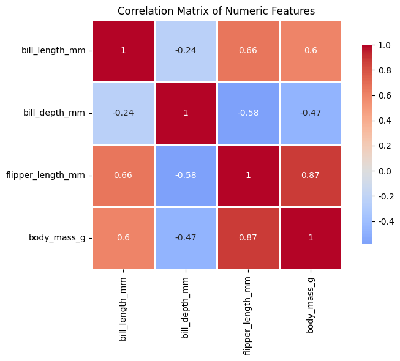

### 그래프 8: 부리 깊이 분포
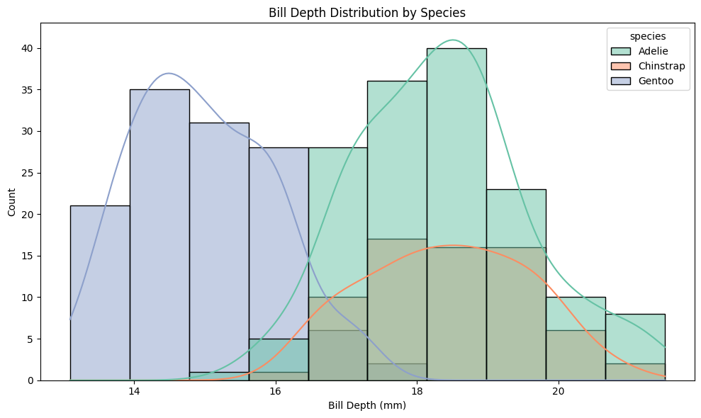

### 그래프 9: 주요 변수 간 관계
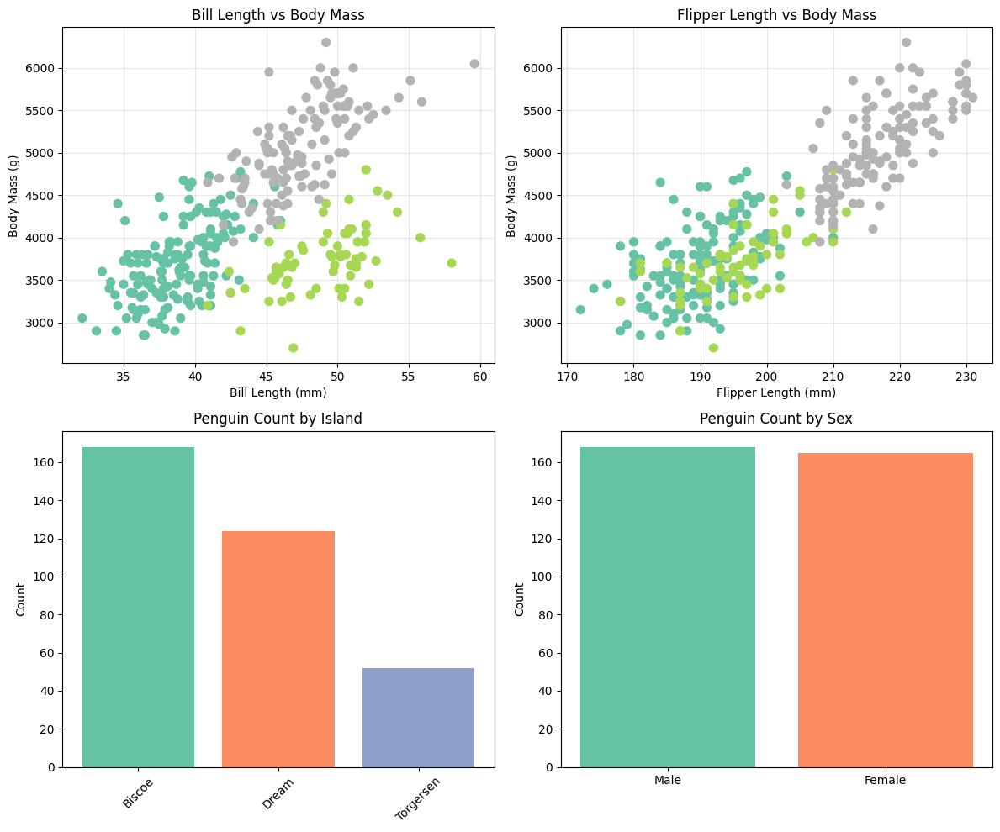

### 그래프 10: 체질량 분포
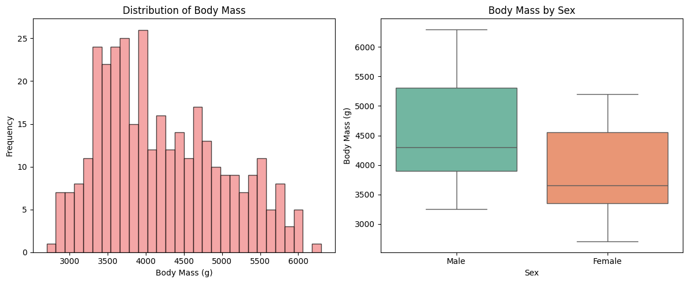

### 그래프 11: 섬별 평균 체질량 라인 플롯
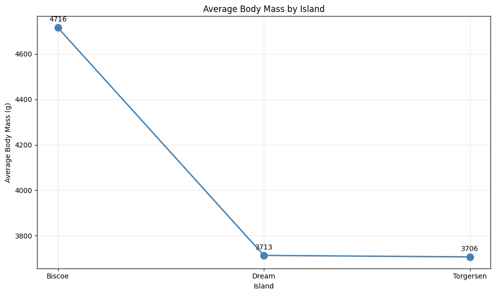

### 그래프 12: 성별 펭귄 개수
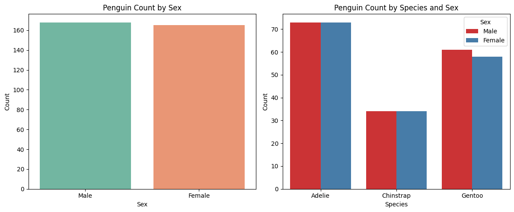

## 4. 교차표 및 피봇테이블 분석

### 교차표 (Crosstab) 분석

#### 섬별 성별 교차표
sex        Female  Male
island                 
Biscoe         80    83
Dream          61    62
Torgersen      24    23

#### 섬별 성별 교차표 (비율)
sex        Female   Male
island                  
Biscoe      49.08  50.92
Dream       49.59  50.41
Torgersen   51.06  48.94

### 피봇테이블 (Pivot Table) 분석

#### 종별 평균 신체 측정값
           bill_depth_mm  bill_length_mm  body_mass_g  flipper_length_mm
species                                                                 
Adelie             18.35           38.79      3700.66             189.95
Chinstrap          18.42           48.83      3733.09             195.82
Gentoo             14.98           47.50      5076.02             217.19

#### 종과 성별별 평균 부리 길이
sex        Female   Male
species                 
Adelie      37.26  40.39
Chinstrap   46.57  51.09
Gentoo      45.56  49.47

#### 종과 성별별 평균 체질량
sex         Female     Male
species                    
Adelie     3368.84  4043.49
Chinstrap  3527.21  3938.97
Gentoo     4679.74  5484.84

#### 섬별 평균 날개 길이
species    Adelie  Chinstrap  Gentoo
island                              
Biscoe     188.80        NaN  217.19
Dream      189.73     195.82     NaN
Torgersen  191.20        NaN     NaN

## 5. 추가 통계 분석

### 성별 통계
       bill_length_mm                                              bill_depth_mm                                               flipper_length_mm                                                   body_mass_g                                                         
                count   mean   std   min    25%   50%    75%   max         count   mean   std   min    25%    50%    75%   max             count    mean    std    min    25%    50%    75%    max       count     mean     std     min     25%     50%     75%     max
sex                                                                                                                                                                                                                                                                    
Female          165.0  42.10  4.90  32.1  37.60  42.8  46.20  58.0         165.0  16.43  1.80  13.1  14.50  17.00  17.80  20.7             165.0  197.36  12.50  172.0  187.0  193.0  210.0  222.0       165.0  3862.27  666.17  2700.0  3350.0  3650.0  4550.0  5200.0
Male            168.0  45.85  5.37  34.6  40.98  46.8  50.32  59.6         168.0  17.89  1.86  14.1  16.08  18.45  19.25  21.5             168.0  204.51  14.55  178.0  193.0  200.5  219.0  231.0       168.0  4545.68  787.63  3250.0  3900.0  4300.0  5312.5  6300.0

### 섬별 통계
          bill_length_mm                                               bill_depth_mm                                              flipper_length_mm                                                    body_mass_g                                                          
                   count   mean   std   min    25%    50%    75%   max         count   mean   std   min    25%   50%    75%   max             count    mean    std    min     25%    50%    75%    max       count     mean     std     min     25%     50%      75%     max
island                                                                                                                                                                                                                                                                      
Biscoe             167.0  45.26  4.77  34.5  42.00  45.80  48.70  59.6         167.0  15.87  1.82  13.1  14.50  15.5  17.00  21.1             167.0  209.71  14.14  172.0  199.50  214.0  220.0  231.0       167.0  4716.02  782.86  2850.0  4200.0  4775.0  5325.00  6300.0
Dream              124.0  44.17  5.95  32.1  39.15  44.65  49.85  58.0         124.0  18.34  1.13  15.5  17.50  18.4  19.00  21.2             124.0  193.07   7.51  178.0  187.75  193.0  198.0  212.0       124.0  3712.90  416.64  2700.0  3400.0  3687.5  3956.25  4800.0
Torgersen           51.0  38.95  3.03  33.5  36.65  38.90  41.10  46.0          51.0  18.43  1.34  15.9  17.35  18.4  19.25  21.5              51.0  191.20   6.23  176.0  187.00  191.0  195.0  210.0        51.0  3706.37  445.11  2900.0  3337.5  3700.0  4000.00  4700.0

